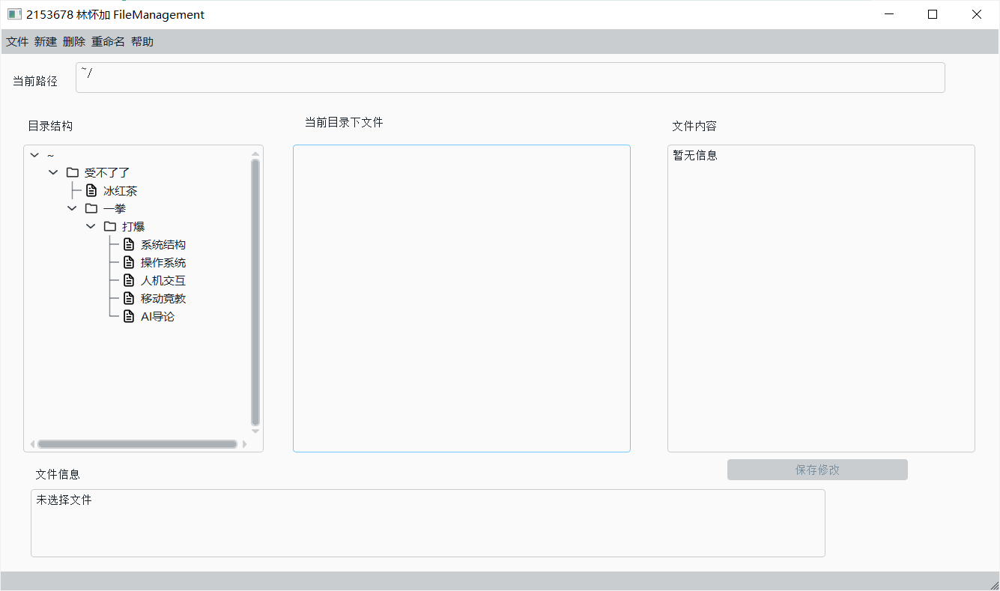
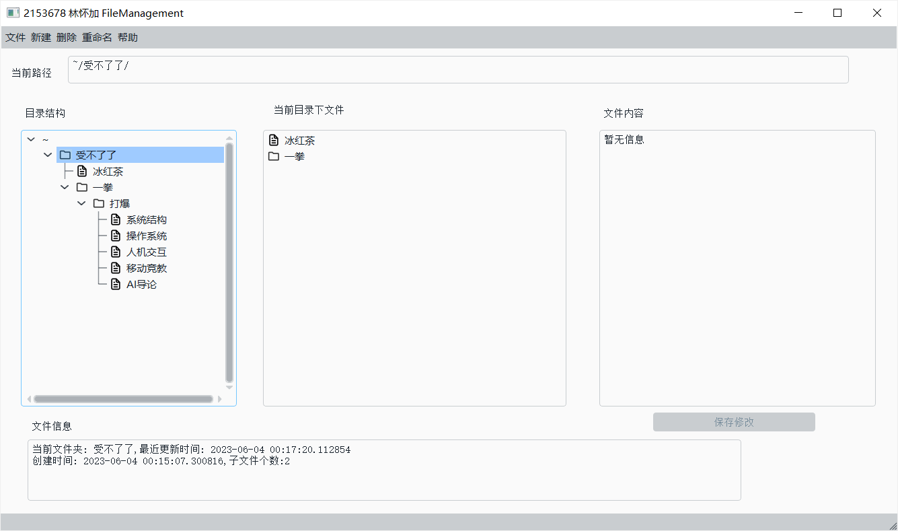
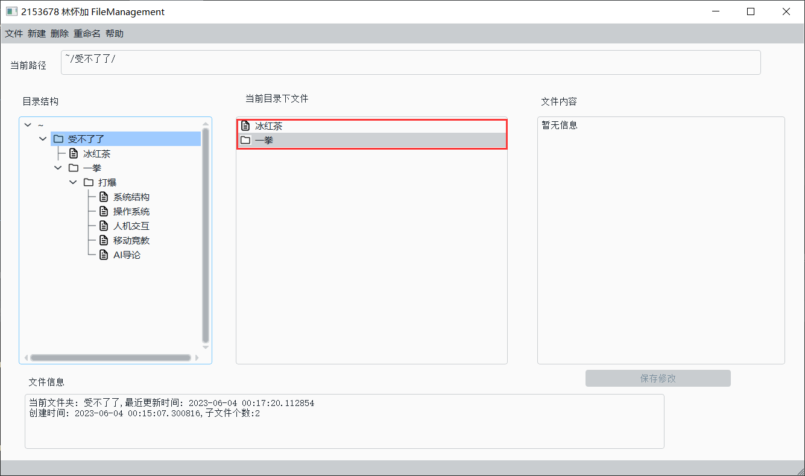
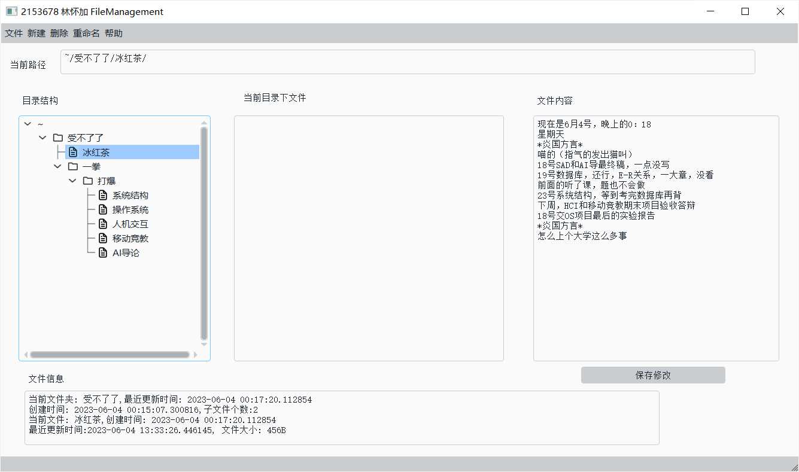
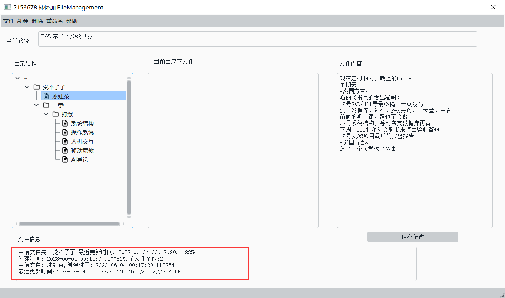

@[TOC](目录)

# OS第三次实验：文件系统模拟

## 目录

* [项目说明](#项目说明)
* [运行要求](#运行要求)
* [程序介绍](#程序介绍)
* [内部实现](#内部实现)
  * [后端](#后端)
  * [前端](#前端)
* [项目总结](#项目总结)


## 项目说明

本项目通过实现一个非常简单的文件系统，来加深对文件系统的理解，完成以下四点：

* **理解文件存储空间的管理**
* **掌握文件的物理结构、目录结构和文件操作**
* **实现简单文件系统管理**
* **加深文件系统实现过程的理解**

具体实现功能如下：

* 实现文件系统状态的保存和格式化
* 实现文件和文件夹的增删与重命名
* 在界面中可以对文件内容进行写入和修改

本项目采取前后端分离的方式实现。后端实现了一个简单的文件管理系统，前端使用Qt实现操作系统的界面化


## 运行要求

*编译器版本：*python3.10

*开发环境：*pycharm2022.3

*模块要求:*

```python
pyqt5 #前端UI
datetime #和文件时间有关
qdarkstyle #QSS主题
pickle #存档读写
bitarry #位图
```

*文件结构要求:*

>./
>│  FileManagement.ui
>│  file_system_components.py
>│  file_system_save.save
>│  main.py
>│  report.md
>│  ui_FileManagement.py
>│
>├─icon
>│      beforedir.png
>│      File.png
>│      HasContentDir.png
>│      NoContentFileDir.png
>│
>└─__pycache__
>        file_system_components.cpython-310.pyc
>        ui_FileManagement.cpython-310.pyc

*运行：*

确保当前文件夹下路径正确并安装指定模块后，在cmd中输入

>python main.py

或者在pycharm中打开该文件夹并运行main.py


## 程序介绍


程序初始界面如下：



点击左侧目录结构可以选择任一文件




点击中间“当前目录下文件"可以选择文件/打开文件夹



在左侧/中间点击文件都可以在右侧进行读取和修改



下方可以读取相关的信息：



上方文件栏/在左侧目录结构右键点击文件或文件夹可以进行文件修改

## 内部实现
本文件后端采用复合链表数据结构实现，前端使用Qt实现UI

### 后端

相关数据结构如下：

FCB :记录存储的文件信息

```python
# 文件信息
class FCB:
    def __init__(self, file_name, create_time, length, parent = None,start_address=None):
        self.file_name = file_name
        self.create_time = create_time
        self.modify_time = create_time
        self.length = length
        self.start_address = start_address
        self.parent=parent
```

FAT: 数组模拟链表，内部存储的都是下一个内存块的地址

```python
class FAT:
    def __init__(self):
        self.block_num = BLOCK_NUM
        self.table = []
        for i in range(BLOCK_NUM):
            self.table.append(FAT_FREE)
```

Disk:模拟磁盘

```python
# 磁盘
class Disk():
    def __init__(self):
        # 用list代替链表指针
        self.list = []
        for i in range(BLOCK_NUM):
            self.list.append("")
```


Freespace:记录每个块的使用情况：

```python
# 空闲空间bitmap
class FreeSpace:
    def __init__(self):
        self.bitmap = bitarray(BLOCK_NUM)
        self.bitmap.setall(0)

```

FileTreeNode: 文件夹结点，子文件夹存储在DirNode，子文件存储在FileNode里，parent记录上一级文件夹的信息。同时存储了一些文件夹的信息：

```python
class FileTreeNode:  # dir
    def __init__(self, name: str,create_time, parent=None):
        self.DirNode = []
        self.FileNode = []
        self.parent = parent
        self.dir_name = name
        self.create_time = create_time
        self.modify_time = create_time
```

FileSystem:实现了对文件系统的增删改查

### 前端

主要是为后端的增删改查添加了几个提示信息并过滤非法输入

左侧树状结构生成：

```python
    def dfsBuildTreeModel
    (self,model:QStandardItemModel,file_tree_node:file_system_components.FileTreeNode):
        for file in file_tree_node.FileNode:
            Item = QStandardItem(file.file_name)
            Item.setIcon(QIcon('./icon/File.png'))
            model.appendRow(Item)

        for dirnode in file_tree_node.DirNode:
            child_model = QStandardItem(dirnode.dir_name)
            child_model.setIcon(QIcon('./icon/NoContentFileDir.png'))
            self.dfsBuildTreeModel(child_model,dirnode)
            model.appendRow(child_model)
```

中间文件结构生成：

```python
    def bulidListView(self) ->QStandardItemModel:
        model = QStandardItemModel()
        if self.cur_selected_dir is not None and self.cur_selected_file is None:
            for file in self.cur_selected_dir.FileNode:
                Item =QStandardItem(file.file_name)
                Item.setIcon(QIcon('./icon/File.png'))
                model.appendRow(Item)
            for childdir in self.cur_selected_dir.DirNode:
                Item = QStandardItem(childdir.dir_name)
                Item.setIcon(QIcon('./icon/NoContentFileDir.png'))
                model.appendRow(Item)
        else:
            model.clear()
        return model
```

UI信号与函数连接（前端的组件连接的处理函数）：

```python
# 记录connect
        self.ui.SaveFile.clicked.connect(self.SaveFile)
        self.ui.FormatFileSystem.triggered.connect(self.sys_format)
        self.ui.Save_System_Status.triggered.connect(self.sys_SaveSys)
        self.ui.CreateDir.triggered.connect(self.sys_create_dir)
        self.ui.CreateFile.triggered.connect(self.sys_create_file)
        self.ui.DeleteDir.triggered.connect(self.sys_delete_dir)
        self.ui.DeleteFile.triggered.connect(self.sys_delete_file)
        self.ui.RenameDir.triggered.connect(self.sys_rename_dir)
        self.ui.RenameFile.triggered.connect(self.sys_rename_file)
        self.ui.actionHelp.triggered.connect(self.sys_Help)
        self.ui.actionAbout.triggered.connect(self.sys_About)
        self.ui.actionaddition.triggered.connect(self.sys_Addition)
```

## 项目总结

本来还有一些小组件想添加，不过时间不够了。

小小的碎碎念：这次项目我第一次遇见在某段代码处打断点然后单步执行这段代码的结果和不打断点然后执行这段代码的结果不一致，彻底打破了我对调试工具的幻想。pyqt5还有共享内存的行为，初始化QStandardModel会直接指向已有model上。部分逻辑冗余的代码就是为了对抗这种优化。
